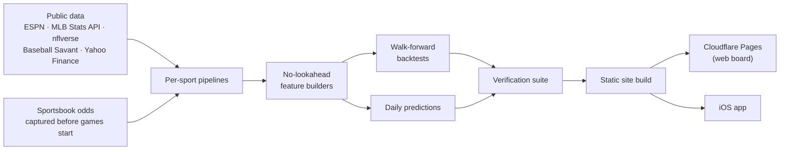

# PontisAi

**Sports and stock predictions that show their work.**
Every call comes with the model's probability, the sportsbook's price, and a public record of how it's done.

🔗 **[Open the live board](https://pontisai.pages.dev)** · 📱 iOS app coming soon · ⭐ Star this repo to hear when it launches

---

## What is PontisAi?

Most betting sites sell confidence. PontisAi sells **honesty**.

Every day, PontisAi works out the chance each team or stock has, puts that number right next to what the sportsbook or market is saying, and tells you in plain English whether there's any value there, including when the answer is *"no edge, pass."* Every past call is graded and kept on the record, wins and losses alike.

It's built for the casual bettor who wants a second opinion that isn't trying to sell them a parlay.

## What's on the board

| | Market | What you get |
|---|---|---|
| 🏈 | **NFL** | Win chances for the full week, next to the book's price |
| ⚾ | **MLB** | A rolling three-day board of game winners |
| 🏈 | **College football** | Weekly win chances for every FBS game |
| 🏀 | **WNBA** | Daily game winners |
| ⛳ | **PGA golf** | Who's likely to make the cut, once the field is set |
| 📈 | **Stocks** | 39 large US stocks ranked nightly by how likely each is to open higher |
| 🧪 | **In research** | NBA, UFC, soccer, crypto. Each is built, but only goes on the board once it passes the same bar as the rest |

## Why trust it?

- **It never peeks at the future.** Every model only learns from games that had already happened at that point. That's how it's tested, and that's how it runs live.
- **It keeps score in public.** More than 26,000 games have been graded so far, and the live record and the historical test results are always kept separate.
- **It tells you when to pass.** If the book has priced a game about right, the board says so.
- **It publishes what didn't work.** Weather, ballparks, advanced contact stats, fancier models: all tested, all rejected, all written up on the site.

## 📱 The app

A native iPhone app is in development. It shows the same board, results and stock picks, redesigned for your phone.

**Status:** pre-launch. The web board is live and free today at **[pontisai.pages.dev](https://pontisai.pages.dev)**. Star or watch this repo to hear when the app arrives.

---

## For engineers and recruiters

PontisAi is a solo project that I designed, built and run end to end: data pipelines, machine learning, a web front end, deployment and a native iOS app. The source is private ahead of launch, and I'm happy to walk through it on a call.

### By the numbers
- **9 prediction verticals**, each with its own data, features and model
- **~88,000 lines of Python**, plus a native **SwiftUI** app
- **Updates every 30 minutes**, fully automated, no manual steps
- **26,000+ games graded** on the public record

### How it works

### Engineering highlights
- **Leak-proof modeling.** Features are built walking forward through time. A verifier proves that changing a later result can't alter any earlier prediction.
- **Train/serve parity checks for every live sport.** Each check proves the live predictor builds exactly the inputs its backtest was scored on. On their first run, the checks caught real mismatches in the NBA, NFL and college football pipelines.
- **Grading against the market, not just coin flips.** Models are compared to sportsbook closing lines with the bookmaker's cut removed, using bootstrap confidence intervals clustered by date, week or event.
- **Robust automation.** The pipeline is scheduled with per-step timeouts, one shared retry policy for every network call, atomic file writes (a crash can never leave a half-written table), and isolated legs, so one sport failing never blocks another.
- **Odds archiving.** Sportsbook prices disappear once a game starts, so the system captures and archives them continuously. That archive is what makes honest grading possible.
- **Security-tested local server.** The rerun endpoint has host, origin, network and single-flight guards, all covered by a 16-case test suite. The public site is published from an allowlist.
- **Right-sized models.** Most sports use regularized logistic regression on engineered features such as tuned Elo ratings, form, rest and starting pitchers. Golf gets gradient boosting because its 100,000+ player-event sample showed a real improvement from it.

### Results I'm proud of, and what I learned

| Model | Result |
|---|---|
| **PGA make-the-cut** | 62.7% on 107,000+ player-events (2013–2026) |
| **Stock picks** | The top-ranked names opened higher 55.9% of the time, vs 53.0% for the average stock (14,000+ picks since 2019) |
| **College football** | Beats the best free public rating for the sport (CFBD Elo) |
| **MLB game winners** | ~57% over six seasons, in line with honestly validated published research |

**The biggest lesson:** being right more often than a coin flip isn't the same as beating the sportsbook. MLB picks beat simple baselines but don't beat the closing line. I tested that on more than 10,000 games, and the board says so openly instead of hiding it. PontisAi is built around finding out what's true, not what makes a nice headline.

### Tech stack
**ML and data:** Python · pandas · NumPy · scikit-learn
**Web:** HTML / CSS / JavaScript static site · Cloudflare Pages
**Mobile:** Swift · SwiftUI
**Ops:** scheduled automation · automated verification suite

---

## About me

I'm **Lucas Montoya**, a Computer Science graduate from New Mexico State University now pursuing my M.S., focused on AI/ML and data analytics.

I like building things end to end: pulling messy real-world data, turning it into models that hold up under honest testing, and shipping them as products people can actually use. PontisAi is where all of that comes together, from the data pipelines and machine learning to the web board and the iOS app.

I'm open to roles in **machine learning, data science, and software engineering**.

📫 [lucas5monts@gmail.com](mailto:lucas5monts@gmail.com) 

---

PontisAi is for entertainment and research. It is not a sportsbook, does not accept bets, and nothing here is betting or financial advice. Please gamble responsibly. If you or someone you know has a gambling problem, call 1-800-GAMBLER.
